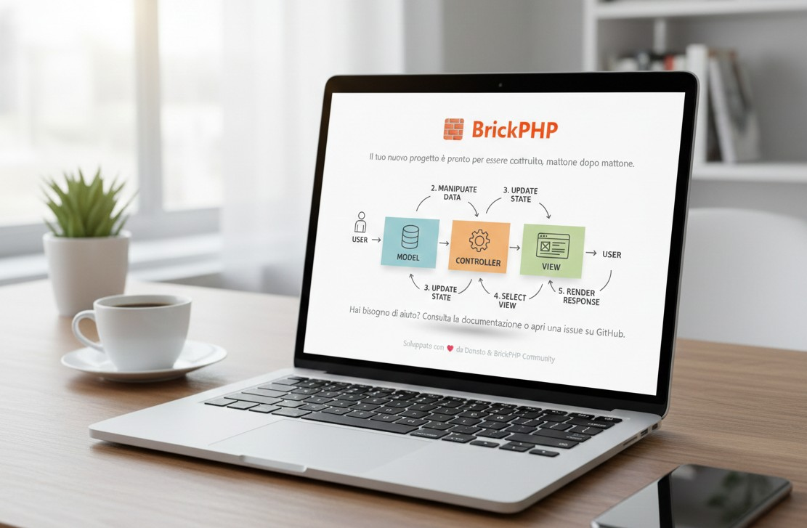
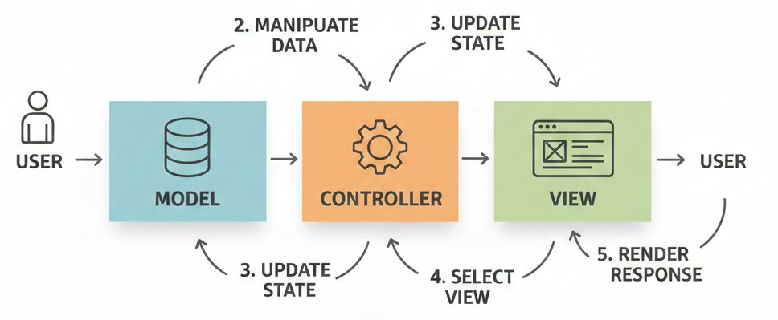

<p align="center">
  
</p>

# 🧱 BrickPHP Skeleton

[](https://packagist.org/packages/brickphp/brickphp)
[](https://packagist.org/packages/brickphp/brickphp)
[](https://packagist.org/packages/brickphp/brickphp)
[](https://php.net)

**BrickPHP** è un micro-framework MVC moderno, leggero e veloce, progettato per sviluppatori che desiderano il controllo totale senza la complessità dei framework più pesanti.

Lo Skeleton è il punto di partenza ufficiale per costruire le tue applicazioni, fornendo un ambiente Docker pre-configurato e una struttura di cartelle pronta all'uso.





---

## 🚀 Caratteristiche Principali

* **Architettura Decoupled:** Il motore [BrickPHP Core](https://github.com/donatodelpeschio/brickphp-core) è separato dall'applicazione.
* **Docker Ready:** Include Docker Compose per PHP 8.2-FPM, Nginx, MySQL 8 e Redis.
* **Zero Config:** Script di installazione automatizzato.
* **CLI Tool:** Utility `brick` per generare controller, modelli e gestire migrazioni.
* **Leggero:** Nessuna dipendenza superflua, solo ciò che serve per correre.

---

## 🛠️ Installazione Rapida

Assicurati di avere installato [Composer](https://getcomposer.org/) e [Docker](https://www.docker.com/).

### 1. Crea il tuo progetto
Lancia il comando per scaricare lo skeleton:

```bash
composer create-project brickphp/brickphp nome-progetto
```

### 2. Setup Automatico
Entra nella cartella e lascia che il Makefile faccia la magia:

```bash
cd nome-progetto
make install
```

Questo comando configurerà il tuo file `.env`, alzerà i container Docker, installerà le dipendenze e preparerà il database.
___
### 3. Inizia a costruire
Visita `http://localhost:8080` e vedrai la tua nuova applicazione attiva.
___
## 💻 Comandi Utili (Makefile)
Abbiamo semplificato la gestione del tuo ambiente di sviluppo:

| Comando | Descrizione |
|-----------|----------------------|
| `make up`  | Avvia i container Docker|
| `make down` | Ferma i container      |
| `make shell` | Entra nel terminale del container PHP      |
| `make migrate` | Esegue le migrazioni del database     |
| `make logs` | Visualizza i log di errore in tempo reale      |
___
## Struttura del Progetto
```
├── app/              # Il cuore della tua app (Controllers, Models)
├── bin/              # Script di sistema (setup, brick CLI)
├── config/           # File di configurazione e rotte
├── database/         # Migrazioni SQL
├── public/           # Entry point (index.php) e asset statici
├── storage/          # Cache, Logs e Sessioni
└── docker/           # Configurazioni Nginx e Dockerfile
```
___
## 🤝 Contribuire
Il progetto è in continua evoluzione. Se vuoi contribuire al motore del framework, dai un'occhiata a [BrickPHP Core](https://github.com/donatodelpeschio/brickphp-core).
___
## Sostieni il progetto
Se trovi BrickPHP utile per i tuoi progetti e vuoi sostenere lo sviluppo:

☕ [Offrimi un caffè su PayPal](https://paypal.me/mailboxporter)

___

## 📜 Licenza
Questo progetto è rilasciato sotto licenza MIT. Consulta il file [LICENSE](LICENSE) per maggiori dettagli.
___
<p align="center">Costruito con passione da <strong>Donato Del Peschio</strong></p>